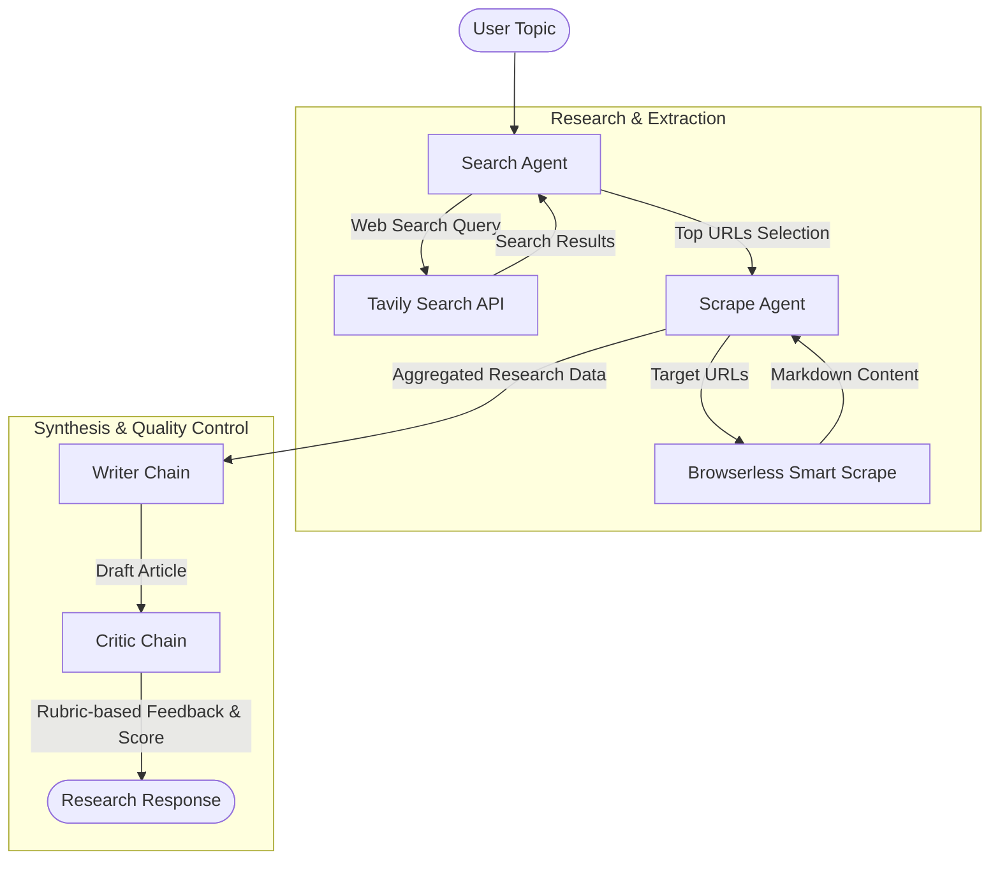

# 🖋️ ScibeFlow

ScibeFlow is an automated, multi-agent AI research and content generation system. Powered by specialized LangChain agents and chains, ScibeFlow searches the web, extracts high-quality article materials, drafts engaging content, and conducts structured editorial reviews to ensure factual accuracy and clarity.

---

## 🔄 Agentic Workflow

ScibeFlow utilizes a four-step pipeline to transform a raw research topic into a polished, evaluated article:



### Detailed Pipeline Phases:

1. **Step 1: Search the Web**
   - The **Search Agent** ([agents.py](file:///c:/GenAI_Projects/Multi-Agent-Research-System/src/agents/agents.py#L20-L22)) queries the web using [Tavily Search](https://tavily.com/) via the `web_search` tool ([tools.py](file:///c:/GenAI_Projects/Multi-Agent-Research-System/src/tools/tools.py#L13-L27)).
   - It filters and returns the top 3 most relevant titles, URLs, and snippet previews.

2. **Step 2: Smart Web Scraping**
   - The **Scrape Agent** ([agents.py](file:///c:/GenAI_Projects/Multi-Agent-Research-System/src/agents/agents.py#L25-L27)) analyzes the candidate search results, picks the most promising URLs, and retrieves the full web page contents.
   - It uses the `scrape_url` tool ([tools.py](file:///c:/GenAI_Projects/Multi-Agent-Research-System/src/tools/tools.py#L33-L56)) via **Browserless Smart Scrape**, transforming HTML directly into clean markdown format for LLM readability.

3. **Step 3: Content Synthesis & Drafting**
   - The **Writer Chain** ([agents.py](file:///c:/GenAI_Projects/Multi-Agent-Research-System/src/agents/agents.py#L30-L57)) takes the combined search results and scraped markdown documents.
   - Employing professional journalism guidelines, it drafts a comprehensive article featuring a compelling hook, structured body sections with subheadings, and a logical conclusion.

4. **Step 4: Editorial Critique**
   - The **Critic Chain** ([agents.py](file:///c:/GenAI_Projects/Multi-Agent-Research-System/src/agents/agents.py#L60-L106)) evaluates the drafted article against the raw source materials.
   - It judges the draft based on a quantitative rubric:
     - **Accuracy** (3 points)
     - **Clarity** (3 points)
     - **Completeness** (2 points)
     - **Engagement** (2 points)
   - It outputs a structured report containing a numerical **SCORE (1-10)**, **STRENGTHS**, **AREAS TO IMPROVE**, and a final one-sentence **VERDICT**.

---

## 🛠️ Tech Stack & Key Integrations

| Technology | Purpose | Implementation File |
| :--- | :--- | :--- |
| **FastAPI** | REST API for triggering pipelines | [api.py](file:///c:/GenAI_Projects/Multi-Agent-Research-System/api.py) |
| **LangChain** | Agent structures, prompts, & chains | [agents.py](file:///c:/GenAI_Projects/Multi-Agent-Research-System/src/agents/agents.py) |
| **Claude Haiku** | Fast, high-accuracy LLM backend | [agents.py](file:///c:/GenAI_Projects/Multi-Agent-Research-System/src/agents/agents.py#L14) |
| **Tavily Search** | High-precision web search API | [tools.py](file:///c:/GenAI_Projects/Multi-Agent-Research-System/src/tools/tools.py#L13-L27) |
| **Browserless** | Fast headless browser for DOM scraping | [tools.py](file:///c:/GenAI_Projects/Multi-Agent-Research-System/src/tools/tools.py#L33-L56) |

---

## 🚀 Getting Started

### 📋 Prerequisites
Make sure you have [uv](https://github.com/astral-sh/uv) or `pip` installed, along with Python 3.10+.

### ⚙️ Setup Instructions

1. **Install Dependencies**
   ```bash
   uv pip install -r requirements.txt
   ```
   *or*
   ```bash
   pip install -r requirements.txt
   ```

2. **Configure Environment Variables**
   Create a `.env` file in the root directory:
   ```env
   ANTHROPIC_API_KEY="your-anthropic-key"
   TAVILY_API_KEY="your-tavily-key"
   BROWSERLESS_API_KEY="your-browserless-key"
   ```

3. **Running the CLI Script**
   You can run a quick terminal test using the pre-configured topic in [main.py](file:///c:/GenAI_Projects/Multi-Agent-Research-System/main.py):
   ```bash
   python main.py
   ```

4. **Running the API Server**
   Start the FastAPI development server:
   ```bash
   uvicorn api:app --reload
   ```

5. **Running the React Frontend Dashboard**
   Navigate to the `frontend` directory, install package dependencies, and boot the Vite development server:
   ```bash
   cd frontend
   npm install
   npm run dev
   ```
   Open `http://localhost:5173` in your browser to experience the ScibeFlow visual workspace.

---

## 🔌 API Endpoints

Once the API server is running, you can access the Swagger documentation at `http://127.0.0.1:8000/docs`.

### 🟢 `GET /`
- **Description:** Health check status.
- **Response:**
  ```json
  {
    "status": "healthy",
    "service": "ScibeFlow API"
  }
  ```

### 🔵 `POST /api/research`
- **Description:** Execute the end-to-end research, write, and critique workflow.
- **Request Body:**
  ```json
  {
    "topic": "Impact of Generative AI on Software Engineering"
  }
  ```
- **Response Body:**
  ```json
  {
    "search_result": "... raw search strings ...",
    "scrape_result": "... scraped markdown content ...",
    "article": "... the generated article text ...",
    "critique": "SCORE: 9\n\nSTRENGTHS:\n- ...\n\nAREAS TO IMPROVE:\n- ...\n\nVERDICT: ..."
  }
  ```

> [!NOTE]
> The scraping step is optimized by truncating outputs to 60,000 characters to prevent context window overflows during heavy scraping tasks.
